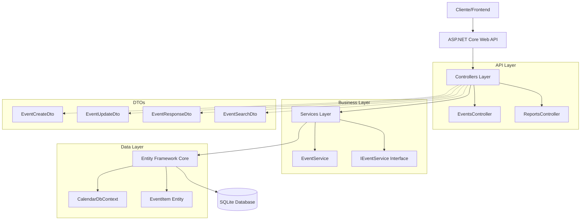
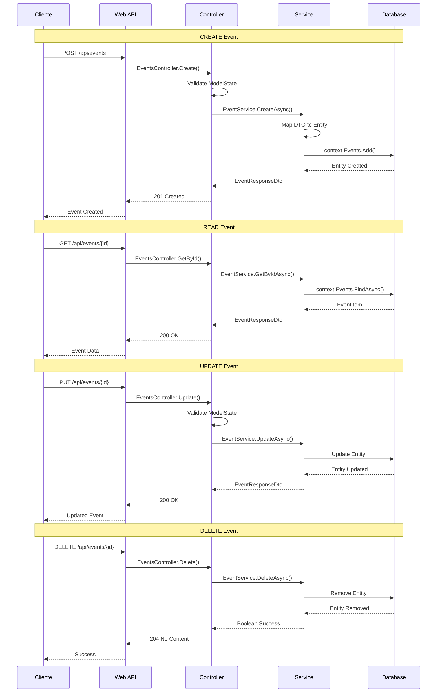
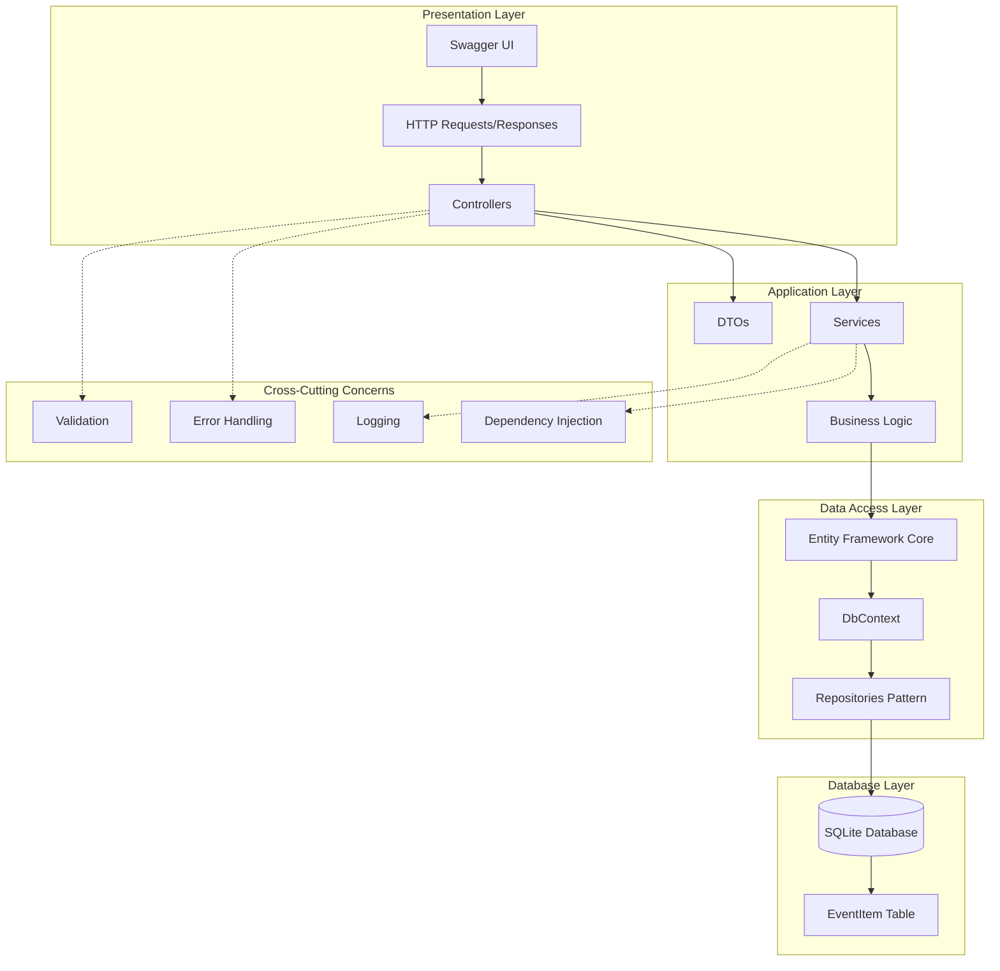
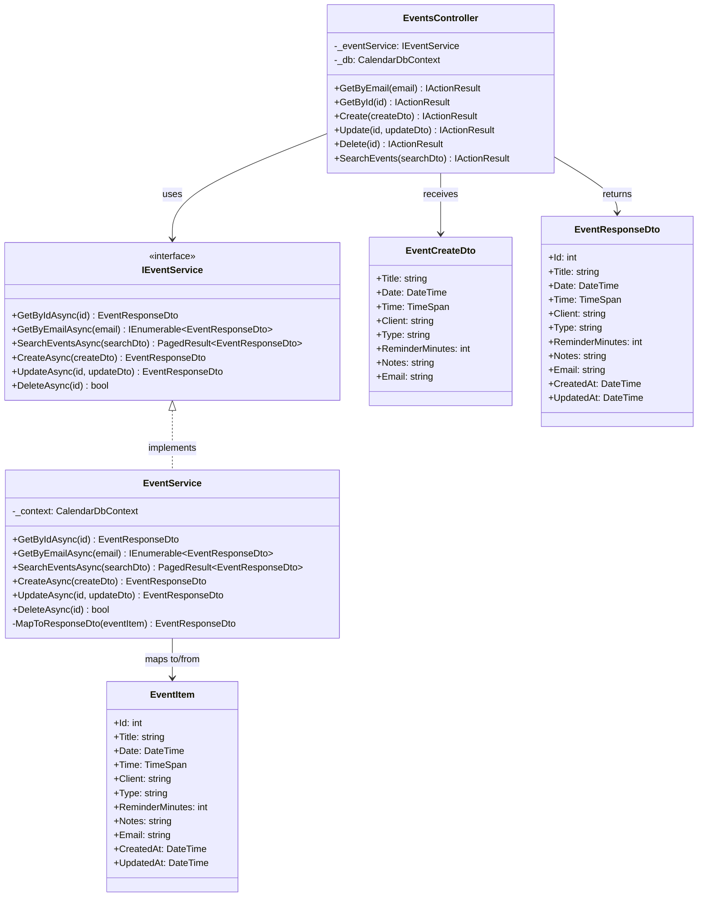
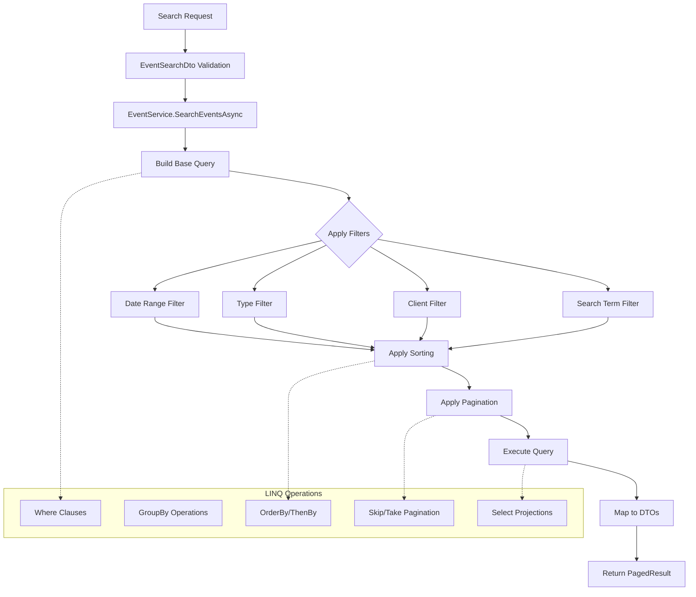
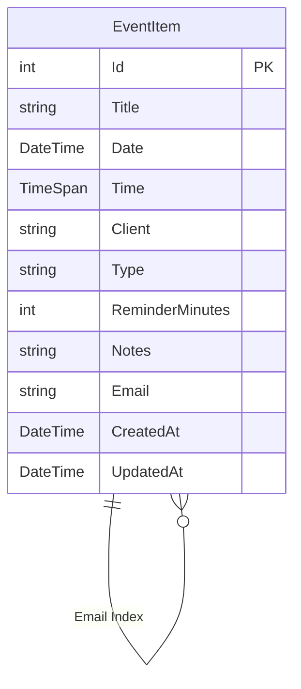
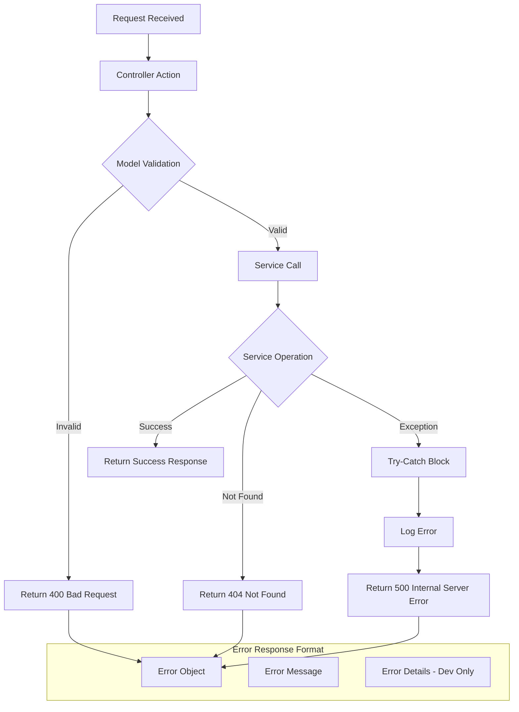
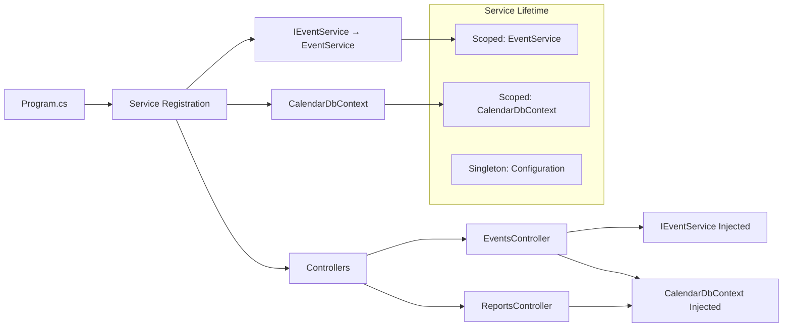
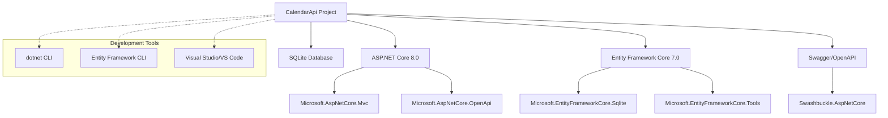

# 🏗️ Diagramas de Arquitetura - CalendarApi Sprint 4

## 1. Arquitetura Geral do Sistema



## 2. Fluxo de Dados - CRUD Operations



## 3. Arquitetura de Camadas (Layered Architecture)



## 4. Padrões de Design Implementados



## 5. Fluxo de Pesquisas LINQ Avançadas



## 6. Estrutura de Banco de Dados



## 7. Fluxo de Tratamento de Erros



## 8. Injeção de Dependência



## 9. Endpoints e Rotas

```mermaid
graph TD
    A[API Base: /api] --> B[Events Controller]
    A --> C[Reports Controller]
    
    B --> D[GET /events?email]
    B --> E[GET /events/{id}]
    B --> F[POST /events]
    B --> G[PUT /events/{id}]
    B --> H[DELETE /events/{id}]
    B --> I[POST /events/search]
    B --> J[GET /events/upcoming]
    B --> K[GET /events/by-type]
    B --> L[GET /events/by-client]
    B --> M[GET /events/statistics]
    B --> N[GET /events/export]
    B --> O[POST /events/import]
    
    C --> P[GET /reports/events-by-period]
    C --> Q[GET /reports/client-productivity]
    C --> R[GET /reports/temporal-trends]
    C --> S[GET /reports/time-conflicts]
```

## 10. Tecnologias e Dependências



---

**Nota:** Estes diagramas representam a arquitetura implementada na Sprint 4, demonstrando os padrões de design, fluxos de dados e estruturas utilizadas no projeto CalendarApi.
